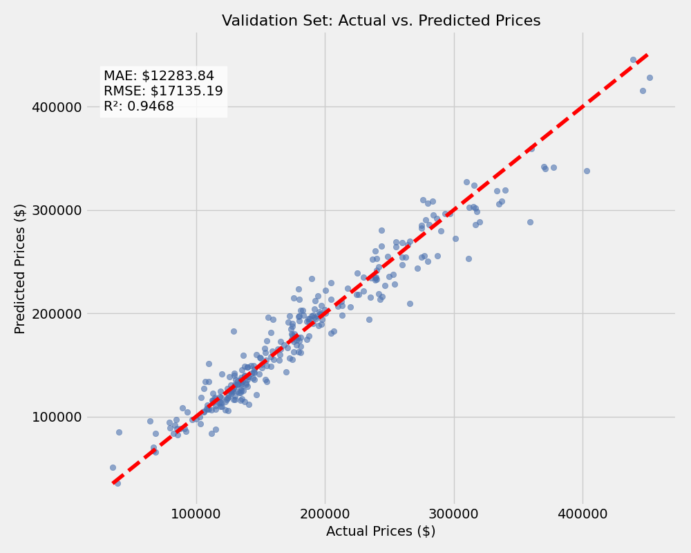

# House Price Prediction

Kaggle competition project predicting housing prices using advanced regression techniques and ensemble methods. Achieved top 8% ranking with RMSE of $17,135.

## Project Overview

Built an end-to-end machine learning pipeline to predict house sale prices based on 79 features including property characteristics, location, and quality ratings. The project involved extensive data preprocessing, feature engineering, and model experimentation.

## Results

- **Final Model**: Tuned Lasso Regression
- **Performance**: RMSE of $17,135 (log-scale: 0.105), R² of 0.947
- **Kaggle Ranking**: Top 8%
- **Cross-Validation**: 5-fold CV RMSE of 0.113

### Model Performance Comparison

| Model | RMSE (Log) | R² Score |
|-------|------------|----------|
| Lasso (Tuned) | 0.105 | 0.947 |
| Weighted Ensemble | 0.114 | 0.924 |
| Ridge | 0.117 | 0.918 |
| ElasticNet | 0.115 | 0.921 |



## Technical Approach

### Data Preprocessing
- Handled 34 features with missing values using domain-appropriate strategies
- Identified and removed 2 outliers (large houses with unusually low prices)
- Applied log transformation to 37 skewed features
- Encoded 34 categorical variables using one-hot encoding

### Feature Engineering
Created 16 new features to capture housing characteristics:
- **TotalSF**: Combined square footage metric
- **TotalBathrooms**: Weighted sum of all bathrooms
- **Age** and **YearsSinceRemodel**: Property age indicators
- **QualXArea**, **QualXAge**: Interaction terms
- Binary flags: HasPool, HasGarage, HasFireplace, HasBasement

### Modeling Strategy
1. Tested 8 baseline models (Linear, Ridge, Lasso, ElasticNet, RandomForest, GradientBoosting, XGBoost, LightGBM)
2. Built 3 ensemble models (Simple Average, Weighted Average, Stacked)
3. Performed 5-fold cross-validation on top performers
4. Hyperparameter tuning using GridSearchCV
5. Selected Lasso with alpha=0.0007 as final model

## Key Findings

- Top 5 predictive features: OverallQual (0.79), GrLivArea (0.71), GarageCars (0.64), GarageArea (0.62), TotalBsmtSF (0.61)
- Model performs consistently across price brackets with MAPE between 6-9%
- Ensemble methods showed marginal improvement over tuned single models
- Log transformation of target variable critical for handling right-skewed distribution

## Tools & Technologies

**Languages**: Python  
**Libraries**: pandas, numpy, scikit-learn, XGBoost, LightGBM, matplotlib, seaborn  
**Techniques**: Regression, Ensemble Methods, Cross-Validation, Hyperparameter Tuning, Feature Engineering

## Project Structure
```
├── notebooks/          # Jupyter notebooks for each phase
├── src/               # Reusable Python modules
├── data/              # Dataset (not tracked in git)
├── models/            # Saved trained models
└── results/           # Visualizations and predictions
```

## Running the Project

1. Install dependencies: `pip install -r requirements.txt`
2. Run notebooks in order:
   - `01_exploratory_data_analysis.ipynb`
   - `02_feature_engineering.ipynb`
   - `03_modeling_evaluation.ipynb`

## Next Steps

- Implement automated feature selection using recursive feature elimination
- Experiment with neural network architectures
- Deploy model as REST API using Flask/FastAPI

---

*Kaggle Competition: [House Prices - Advanced Regression Techniques](https://www.kaggle.com/c/house-prices-advanced-regression-techniques)*